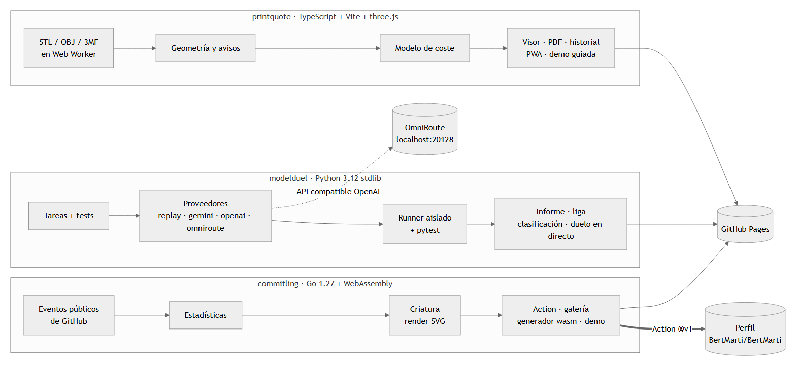
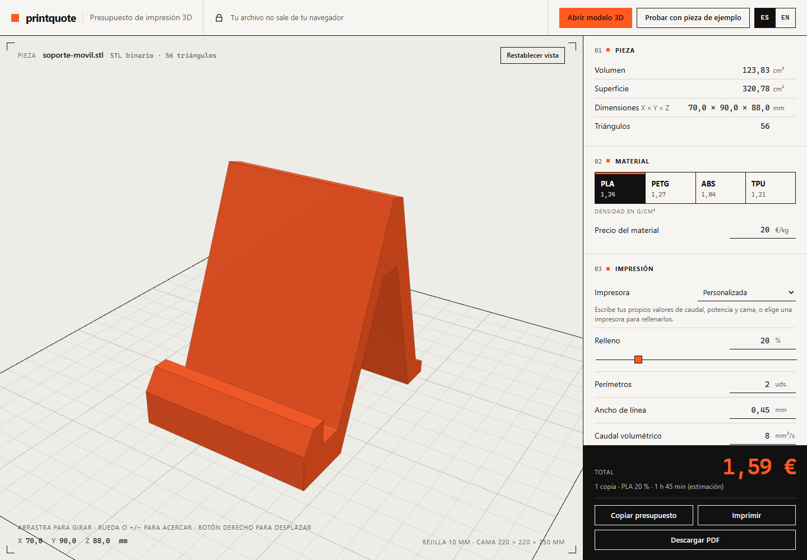
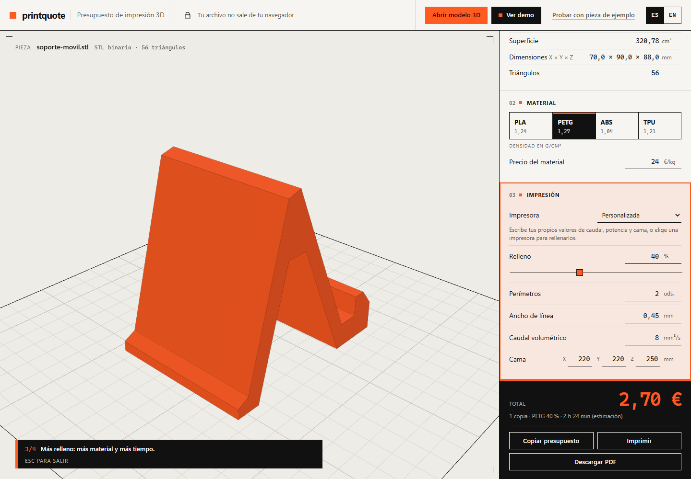
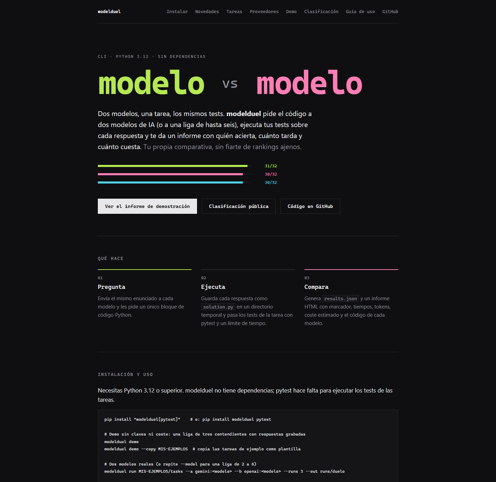
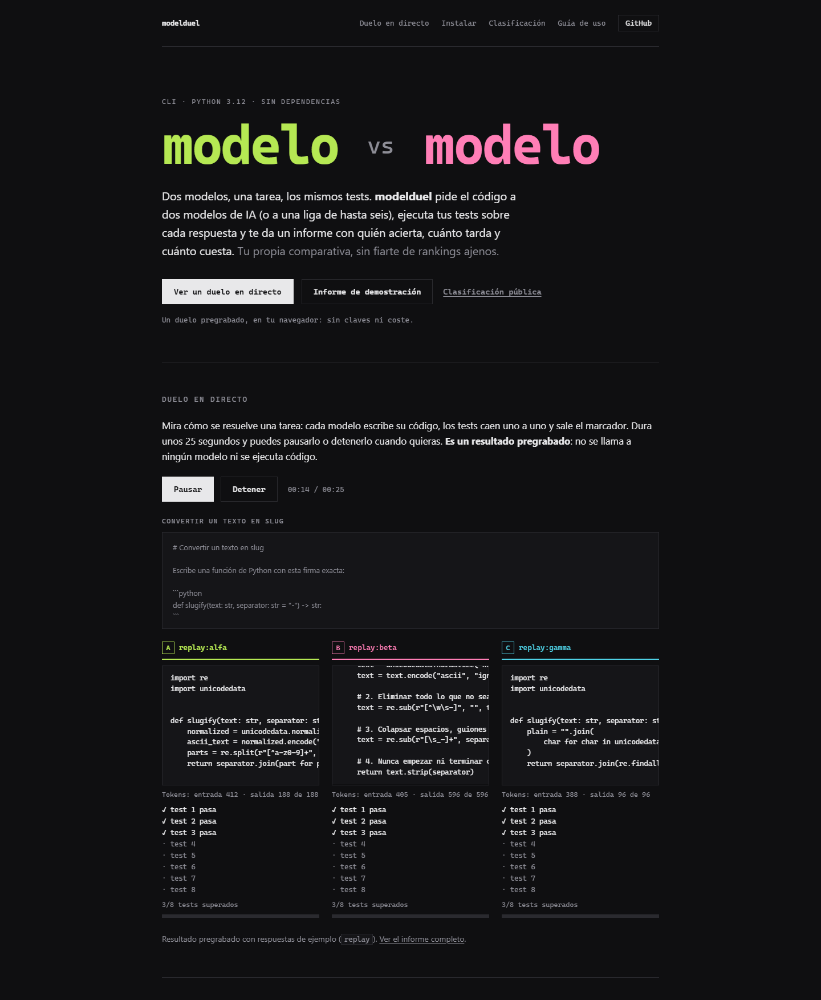
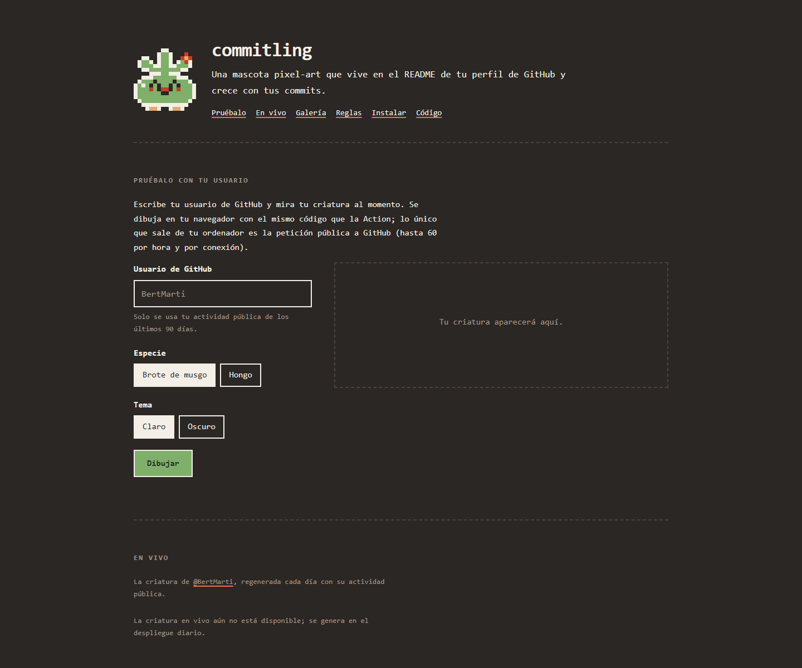
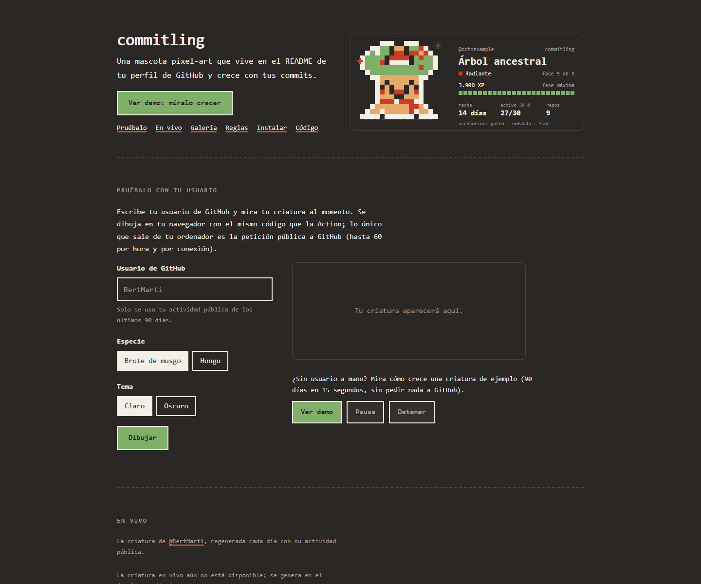
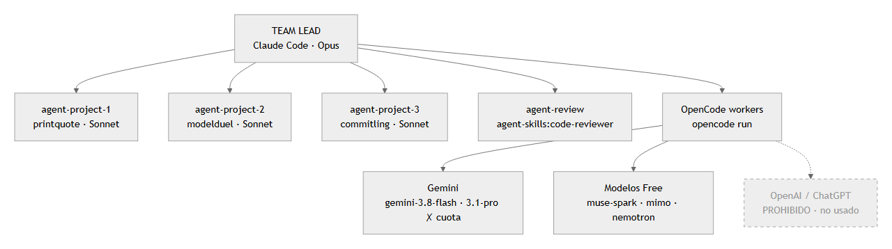
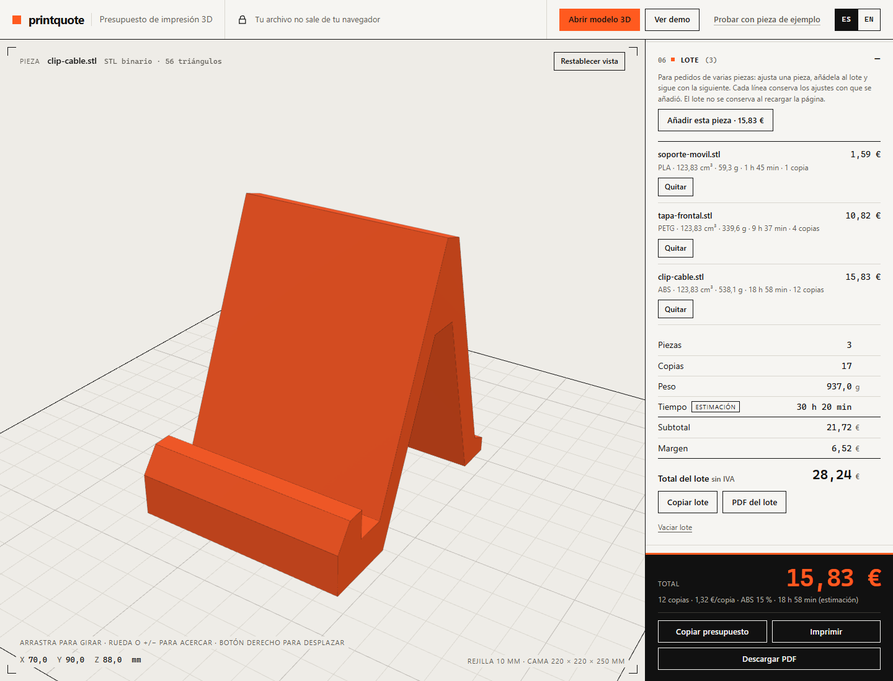
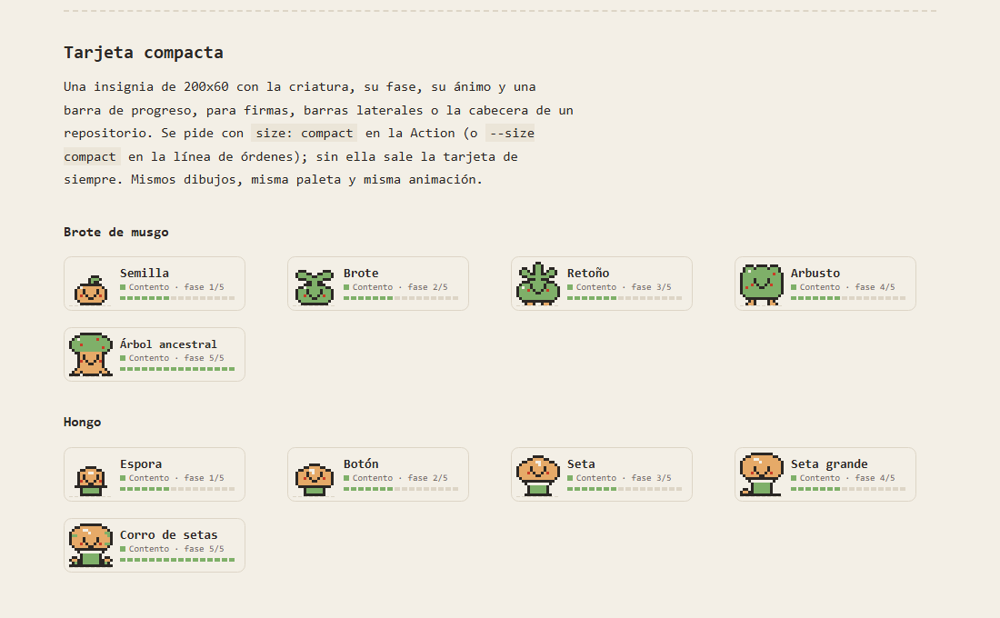

# Reporte técnico de sesión · Claude Code

# 1. Executive Summary

Durante esta sesión un equipo multiagente coordinado por Claude Code ha llevado los tres proyectos de la v0.2 a la **v0.6.0**, con tres fases visibles para la persona usuaria: la versión «Pro» (v0.4), la versión con **estética profesional y modo demo en tiempo real** (v0.5) y la versión con **una función de producto por app y la deuda saldada** (v0.6, §18).

| Proyecto | Versión publicada | Web | Novedad de la v0.5 | Novedad de la v0.6 |
|---|---|---|---|---|
| printquote | [v0.6.0](https://github.com/BertMarti/printquote/releases/tag/v0.6.0) | https://bertmarti.github.io/printquote/ | «Ver demo»: recorrido guiado de ~13 s con el total recalculándose en vivo | Presupuesto por lotes (varias piezas, PDF multipágina, CSV) |
| modelduel | etiqueta v0.6.0 (la release dispara PyPI, pendiente) | https://bertmarti.github.io/modelduel/#demo | «Duelo en directo»: reproduce un duelo grabado con código, tests y marcador en tiempo real | Informe en Markdown seguro para pegar en GitHub |
| commitling | [v0.6.0](https://github.com/BertMarti/commitling/releases/tag/v0.6.0) + `v1` | https://bertmarti.github.io/commitling/ | «Míralo crecer»: timelapse de 90 días con WebAssembly, sin llamar a GitHub | Tarjeta compacta 200x60 y sin desborde a 320 px |

- Los tres repositorios terminan con `main` en verde (CI y despliegue en GitHub Pages).
- Todo cambio entró por pull request y pasó por un agente revisor. Las revisiones bloquearon y corrigieron **5 fallos reales** antes de publicar:
  - en modelduel, dos XSS en la v0.4, y en el duelo en directo, el foco perdido y un veredicto engañoso;
  - en printquote, la pérdida del archivo soltado durante la demo.
- OpenCode se usó con Gemini y con modelos gratuitos, con *failover* real por cuota. OpenAI no se usó en esta fase (detalle en §OpenCode Usage).

# 2. Estado inicial de los 3 proyectos

Al empezar esta fase (01/10/2026, 07:50) los tres estaban en v0.4.0, fusionados y desplegados, sin PR abiertos:

| Proyecto | Estado inicial | Pendientes heredados |
|---|---|---|
| printquote | v0.4.0: PWA instalable, historial con CSV y enlace para compartir | Ninguno abierto |
| modelduel | v0.4.0 (etiqueta): proveedor `omniroute:` y clasificación pública | Issues #18 y #19, bloqueadas por la publicación en PyPI |
| commitling | v0.4.0 + `v1`: generador en vivo con WebAssembly | Ninguno abierto |

# 3. Trabajo realizado por proyecto

## printquote (TypeScript + Vite + three.js + pdf-lib)

- **Hito v0.5.0:** issues #36 (pulido) y #37 (demo). PR [#38](https://github.com/BertMarti/printquote/pull/38) y [#39](https://github.com/BertMarti/printquote/pull/39). Especificación en `docs/specs/v0.5.md`.
- **Modo demo («Ver demo»):**
  - carga la pieza de ejemplo, gira la cámara y pasa por PLA→PETG y relleno 20→40 %;
  - el total pasa por 1,59 → 1,94 → 2,70 → 1,59 € y se resalta el bloque que cambia, con subtítulo;
  - se para con un segundo clic, Esc, cualquier interacción, arrastrar un archivo o cambiar el enlace;
  - con `prefers-reduced-motion` va paso a paso;
  - no escribe nunca en `localStorage` ni en el historial (medido: 0 escrituras);
  - funciona sin conexión gracias al precaché de la PWA.
- **Estética y UX:**
  - jerarquía de tres niveles en la cabecera;
  - el aviso va en una banda que ya no tapa el nombre de la pieza;
  - dianas de 44 px en táctil sin romper la retícula;
  - sin desborde a 320 px;
  - nombre accesible del visor corto, con las teclas en `aria-describedby`;
  - `.button[hidden]` corregido.

## modelduel (Python 3.12 stdlib + web estática)

- **Hito v0.5.0:** issues #30-#33. PR [#34](https://github.com/BertMarti/modelduel/pull/34) a [#37](https://github.com/BertMarti/modelduel/pull/37).
- **Duelo en directo:** `site/demo.js`, JavaScript vanilla y diferido.
  - Hace `fetch` de `demo/results.json` solo al pulsar.
  - Escribe el código grabado a un ritmo proporcional a la latencia, con contadores de tokens y tests ✓/✗ con texto.
  - Termina con barras, marcador y un veredicto **acotado a la tarea**, con la salvedad visible de que el informe completo agrega todas.
  - Pausa y Detener, devolviendo el foco al botón principal. Pausa al ocultar la pestaña y no arranca sola.
  - `aria-live` solo en las fases. `role="alert"` en el error de carga.
  - Los recortes se avisan («… (recortado)», «mostrando 200 de N»). Todo con `textContent`.
- **Informes y portada:**
  - «▲ mejor / ▼ peor» con glifo y texto en lugar de opacidad;
  - tipografía de al menos 12 px;
  - subrayado visible y `:focus-visible`;
  - enlace de vuelta a la web;
  - portada con una sola acción primaria y la navegación reducida a 5 enlaces;
  - tabla desplazable accesible;
  - fila de `omniroute` en la tabla de proveedores;
  - barras con datos copiados a mano retiradas;
  - contraste AA de la portada cubierto por un test.

## commitling (Go 1.27 + WebAssembly + Action)

- **Hito v0.5.0:** issues #28-#31. PR [#32](https://github.com/BertMarti/commitling/pull/32) a [#35](https://github.com/BertMarti/commitling/pull/35) y el pulido [#36](https://github.com/BertMarti/commitling/pull/36).
- **«Míralo crecer»:**
  - `generate.Demo(day)` reproduce 90 días sintéticos deterministas de un usuario ficticio, con las 5 fases, los 4 ánimos y los 3 accesorios;
  - el wasm expone `commitling.demo(day, species, theme)`;
  - timelapse de 15 s con contador de días, Pausa y Detener;
  - deslizante manual con `prefers-reduced-motion`;
  - **0 peticiones a GitHub** (verificado en la web publicada).
- **Estética:**
  - la cabecera muestra la tarjeta animada real;
  - escenario del generador coherente con «papel y píxel»;
  - corregido el desborde móvil real: era un `<pre>` dentro de una rejilla sin `minmax(0,1fr)`;
  - cabecera de una columna hasta 860 px.
- **Sin cambios:** los sprites, que son un diseño original propio, y `action.yml`. El perfil sigue funcionando con `@v1`, movida a la v0.5.0.

# 4. Trabajo multiagente

| Agente | Proyecto | Responsabilidad | Resultado |
|---|---|---|---|
| TEAM LEAD (Claude Code · Opus) | Los tres | Inventario de herramientas, reparto, dependencias, fusiones, releases, verificación en la web publicada, diagramas y este reporte | 3 versiones publicadas y todo el CI en verde |
| agent-project-1 (Sonnet) | printquote | Spec, issues, pulido, demo y correcciones de revisión | PR #38 y #39, 415 tests |
| agent-project-2 (Sonnet) | modelduel | Spec, issues, informes accesibles, portada, duelo en directo y correcciones | PR #34-#37, cobertura 96,24 %, 26 pruebas de Node |
| agent-project-3 (Sonnet) | commitling | Spec, issues, demo wasm, estética y pulido | PR #32-#36 |
| agent-review ×3 (`agent-skills:code-reviewer`) | Uno por proyecto | Revisión de cinco ejes más Ponytail, solo lectura | 3 lotes revisados; 2 con cambios necesarios |
| OpenCode workers | Los tres | Auditorías UX independientes y segundas opiniones | 3 auditorías útiles; 3 segundas opiniones fallidas (§OpenCode) |

# 5. Plugins e integraciones utilizadas

| Herramienta | Estado | Uso real | Resultado |
|---|---|---|---|
| Superpowers | Utilizado | `superpowers:test-driven-development` y `superpowers:verification-before-completion` (printquote); TDD en modelduel | Tests escritos antes del código; cada guarda nueva se comprobó quitándola y viendo el test fallar |
| Frontend Design | Utilizado | `frontend-design:frontend-design` en los tres proyectos | Cambios visuales coherentes con la identidad de cada AGENTS.md |
| Ralph Loop | No necesario | Las tareas tenían ciclos cortos de TDD dentro de cada agente; el bucle depende del hook de parada de la sesión principal y no debe anidarse | — |
| Context7 | Utilizado (fases anteriores) / No necesario (v0.5) | Con `equipo/c7.py`, porque el MCP del plugin pide OAuth | Ver §7 |
| Ponytail | Utilizado | Criterio permanente y eje de cada revisión | Sin dependencias nuevas en la v0.5; se descartaron las propuestas complejas (barra de progreso del wasm, `IntersectionObserver`) |
| Agent Skills | Utilizado | `agent-skills:spec`, `agent-skills:plan`, `agent-skills:frontend-ui-engineering` y el agente `agent-skills:code-reviewer` | Especificaciones v0.5, issues por hito y 3 revisiones |
| Graphify | Utilizado | Un grafo por proyecto en `graphify-out/` | Ver §8 |
| OmniRoute | No activo | La sesión no se enruta por OmniRoute; está integrado como proveedor `omniroute:` en modelduel, probado con respuestas simuladas | Sin claves de proveedor no puede llamar a modelos reales |
| OpenCode | Utilizado | `opencode run` con Gemini y modelos gratuitos | Ver §OpenCode Usage |

# 6. Skills específicas utilizadas

| Skill | Fuente | Tarea | Resultado |
|---|---|---|---|
| `agent-skills:spec` | Agent Skills | Especificaciones v0.5 de printquote (y v0.4 de los tres) | `docs/specs/v0.5.md` con suposiciones escritas |
| `agent-skills:plan` | Agent Skills | Hito e issues v0.5 de printquote | Issues #36 y #37 |
| `agent-skills:frontend-ui-engineering` | Agent Skills | Interfaz de printquote y modelduel | Dianas de 44 px, regiones accesibles |
| `agent-skills:code-reviewer` (agente) | Agent Skills | Revisión de los 3 lotes v0.5 | Hallazgos reproducidos en navegador |
| `superpowers:test-driven-development` | Superpowers | Demo de printquote y modelduel | 415 tests (printquote), 26 pruebas de Node (modelduel) |
| `superpowers:verification-before-completion` | Superpowers | Cierre de printquote | Verificación con mediciones antes de entregar |
| `frontend-design:frontend-design` | Frontend Design | Los tres | Pulido visual |
| `dataviz` | Claude Code | Barras del duelo en directo | Una barra por contendiente, con letra y texto |
| `graphify` | Graphify | Orientación y actualización de grafos | Ver §8 |

# 7. Context7

Consultado con `equipo/c7.py`, que llama por HTTP anónimo al servidor MCP de Context7, porque el MCP del plugin pide autorización OAuth.

| Tecnología | Documentación | Motivo | Decisión |
|---|---|---|---|
| pdf-lib + `@pdf-lib/fontkit` | `/hopding/pdf-lib` | Incrustar fuentes con cobertura no latina | Fuentes OFL recortadas y `subset: true`, cargadas bajo demanda (v0.3) |
| GitHub Actions compuestas | Docs de Actions | Entradas booleanas y `::warning::` en `keep-on-error` | Validación con `case` true/false (v0.3) |
| Go `syscall/js` y wasm | `/golang/go` | Carga y exposición de funciones al navegador | Capa fina en `cmd/wasm`, carga diferida (v0.4) |
| Plugin de Vite (`generateBundle`, `closeBundle`) | Docs de Vite | Generar el service worker con hash de versión | Caché versionada por hash de `dist/` (v0.4) |
| v0.5 | — | No hizo falta: no hubo APIs nuevas de librerías | — |

# 8. Graphify

| Repositorio | Grafo actual (`graphify-out/`) | Uso |
|---|---|---|
| printquote | 851 nodos · 2152 aristas · 37 comunidades | Localizar `app.ts`, `demo.ts` y los estilos antes de tocar la interfaz |
| modelduel | 1007 nodos · 2271 aristas · 70 comunidades | Localizar el veredicto, la clasificación y los informes |
| commitling | 593 nodos · 1630 aristas · 24 comunidades | Flujo `cmd` → `internal/github` → `generate` → `render` y la capa wasm |

- Cada proyecto mantiene su propio grafo, generado con `graphify update .` solo con análisis de código y sin modelo. Están ignorados en git y se actualizaron al final de la fase.
- **Decisión tomada gracias al grafo:** en commitling, la separación `internal/events` / `internal/github` (v0.4) permitió que el wasm no enlazara `net/http`, y la v0.5 añadió `generate.Demo` reutilizando `stats.Compute` y `render` sin un motor nuevo.

# 9. Arquitectura

- **printquote:** el lector y el análisis van en un Web Worker, el modelo de coste son funciones puras, y el visor three.js y el PDF se cargan bajo demanda. La PWA tiene la caché versionada. La demo es un guion de pasos (`src/ui/demo.ts`) sobre una interfaz `DemoHost` probada sin `app.ts`.
- **modelduel:** el núcleo Python sin dependencias genera `results.json` e informes HTML sin JavaScript. La web estática añade un único `demo.js` diferido que consume ese mismo `results.json`.
- **commitling:** el mismo código Go sirve a la CLI, a la Action compuesta y al wasm de la galería, con renderizado determinista byte a byte.

# 10. Relaciones entre los tres proyectos

No hay dependencias de código entre ellos. Las de integración son:
1. **commitling → perfil `BertMarti/BertMarti`**, mediante la Action `@v1`. Se movió `v1` a la v0.5.0 sin cambiar la interfaz.
2. **modelduel → OmniRoute**, mediante el proveedor `omniroute:` compatible con la API de OpenAI. Está pendiente de que haya claves de proveedor.
3. **Los tres → `curso_ia_MoureDev`**: reportes, PDF y este documento.
4. **Los tres → GitHub Pages**, con un despliegue en cada fusión a `main`.

# 11. Cambios importantes

- Modo demo en tiempo real en las tres apps, sin servidor, claves ni datos personales.
- Pulido visual y de accesibilidad guiado por auditorías externas, verificadas punto por punto.
- Cada agente actualizó su `AGENTS.md` (sección de demo y ajustes visuales) y su `MEMORY.md`.
- Regla nueva del equipo: no ejecutar binarios de test de Go en el PC de Alberto (§13).

# 12. Testing

| Proyecto | Comando | Resultado |
|---|---|---|
| printquote | `npm ci && npm run lint && npm test && npm run build` | 415 tests en verde, lint limpio, build correcto (CI en Ubuntu y Windows) |
| modelduel | `ruff check . && ruff format --check . && pytest --cov` | En verde, cobertura 96,24 % (mínimo 90 %) |
| modelduel | `node --test "tests/js/*.test.cjs"` | 26 pruebas en verde (job `web` del CI) |
| commitling | `gofmt -l .`, `go vet ./...`, `go build ./...` (local) | En verde |
| commitling | `go test ./...` y tests del wasm en Node (CI) | En verde en Ubuntu y Windows, más la prueba de la Action |
| Los tres | Despliegue en GitHub Pages tras la fusión | Correcto; URLs comprobadas con HTTP 200 |

# 13. Problemas encontrados

| Síntoma | Causa raíz | Solución | Herramienta |
|---|---|---|---|
| Avisos repetidos de «Seguridad de Windows» por `gallery.test.exe` | Smart App Control bloquea binarios de test de Go sin firmar | Sin `go test`/`go run` en local; tests en el CI. No se tocaron ajustes de seguridad | Regla en `equipo/HERRAMIENTAS.md` |
| `gemini-3.1-pro-preview` falla | Cuota 0 en el plan gratuito | *Failover* a modelo gratuito | OpenCode |
| `gemini-3.8-flash` falla al leer el repo | Límite de 5 peticiones/minuto | *Failover* a modelo gratuito | OpenCode |
| `opencode run -f <archivo>` sin salida o con tiempo agotado | Se cuelga con archivos adjuntos en esta instalación (3 de 3 intentos) | Usar OpenCode solo en tareas que lean el repo por sí mismas | OpenCode |
| Soltar un archivo durante la demo lo perdía (printquote) | El arrastre no genera los eventos de parada; `end()` restauraba la pieza anterior | `dragenter`/`drop`/`hashchange` paran la demo y solo se restaura lo que la demo cambió; 8 tests | agent-review + TDD |
| El foco se perdía al pulsar Detener (modelduel) | Se ocultaba el botón que tenía el foco | Devolver el foco al botón principal; test con DOM simulado | agent-review + TDD |
| El veredicto del directo contradecía al informe (modelduel) | Ordenaba una sola tarea por tests y latencia | Veredicto acotado a la tarea, con salvedad visible | agent-review |
| La cabecera de commitling se rompía en tablet vertical | Breakpoint en 720 px con dos columnas | Una columna hasta 860 px | agent-review |
| Diagramas: Kroki responde 500 en PNG | Servicio externo | Mermaid en Chrome sin interfaz y recorte con PIL | `diagrams/render.py` |
| No se pudo ver el timelapse en el navegador del panel | Pestaña oculta: 0 fotogramas de `requestAnimationFrame`; la demo se pausa por diseño | Verificado sin red y como imagen; queda la comprobación visual para Alberto | Navegador del panel |
| Límites de uso de Claude cortaron agentes 3 veces | Cuota de la sesión | Reanudación desde el contexto de cada agente, sin perder trabajo | SendMessage |

# 14. Decisiones técnicas

- **Demos sin servidor y sin datos reales:** pieza de ejemplo, duelo grabado y usuario ficticio. Coste cero, privacidad y funcionamiento sin conexión.
- **Auditorías externas como entrada, no como verdad:** cada dueño las verificó. Por ejemplo, printquote descartó con mediciones «el total no se ve en escritorio», y commitling no tocó el contorno del sprite.
- **Al terminar, la demo de printquote devuelve el estado de la persona:** no deja el estado de la demo, para no pisar sus ajustes guardados.
- **modelduel sin release de GitHub:** la release dispara la publicación en PyPI, que aún no está configurada. Se crean solo etiquetas.

# 15. Riesgos y deuda técnica real

- ~~commitling: a 320 px el documento mide 338 px~~ → resuelto en v0.6 (medido 320 px en la web publicada).
- ~~modelduel: capturas del duelo en directo obsoletas~~ → regeneradas en v0.6.
- ~~Tests de commitling que comparan cadenas exactas de CSS~~ → sustituidos por tests de intención en v0.6.
- **printquote:** el lote vive en memoria (no sobrevive a recargar) y un lote guardado en el historial no se puede reabrir (no se guarda la geometría).
- **printquote, documentación:** el CHANGELOG de la v0.6 dice que `og.png` muestra el bloque del lote y no lo muestra; el README aún dice «una página A4». Retoques opcionales sin aplicar (§18).
- **Sin probar** en móvil real, con lector de pantalla real ni con la PWA instalada.
- **Sin probar contra servicios reales:** `gemini`, `openai` y `omniroute` en modelduel solo se han probado con respuestas simuladas.

# 16. Trabajo pendiente

1. **Comprobaciones visuales.** Pulsar «Ver demo» en las tres webs con la pestaña visible (sobre todo el timelapse de commitling) y mirarlas a 375 px.
2. **PyPI (modelduel).** Configurar el *pending publisher* y el environment `pypi`, crear la release, y luego cerrar #18 y #19.
3. **OmniRoute.** Conectar al menos un proveedor gratuito para hacer duelos reales.
4. **Context7.** Autorizar el MCP con `/mcp` para usarlo de forma nativa.
5. **Retoques de printquote v0.6** (decisión de Alberto, §18): documentación del lote, anuncio de «Lote lleno», etiqueta accesible del lote guardado.
6. **Probar la v0.6 a mano:** un lote de 3 piezas en printquote, pegar un `informe.md` de modelduel en un issue de prueba y poner `size: compact` en el perfil.

# 17. Estado final de cada proyecto

| Proyecto | Versión | `main` | Web |
|---|---|---|---|
| printquote | v0.6.0 (release) | CI y despliegue en verde | «Ver demo» y bloque «06 Lote» publicados |
| modelduel | v0.6.0 (etiqueta) | CI (4 jobs) y despliegue en verde | Duelo en directo y `og:image` publicados |
| commitling | v0.6.0 (release) + `v1` | CI, Action y despliegue en verde | «Míralo crecer» y tarjeta compacta publicados |

# 18. Fase v0.6.0

Plan: una función de producto por app, saldar la deuda de §15 y una auditoría de rendimiento medida de las tres webs como entrada para el pulido. Mismo flujo: issues en el hito, una rama y un PR por issue, revisión por `agent-skills:code-reviewer`, fusión y publicación por el lead. Traza completa en `evidence/traza-fase6.md`.

## Auditoría de rendimiento (agent-skills:web-performance-auditor)

Medida con Chrome sin interfaz (móvil Slow-4G con CPU x4 y escritorio) y curl. Las tres tienen CLS 0, ninguna fuente web y ningún script que bloquee. Detalle en `evidence/auditoria-rendimiento-v06.md`.

| Web | Carga inicial (gz) | FCP / LCP móvil | Acción aplicada |
|---|---|---|---|
| printquote | 185,9 KB | 748-824 ms | El service worker ya no vuelve a descargar los `assets/*` con hash: −177 KB en la primera visita |
| modelduel | 13,0 KB | 904 ms | Nada de rendimiento; se añadió `og:image` y `twitter:card` |
| commitling | 17,6 KB | 588 / 736 ms | El wasm empieza con `pointerdown` y se pide en paralelo con `wasm_exec.js` (≈−176 ms en Slow-4G); la criatura en vivo es diferida |

Descartado con motivo: precalentar el PDF de printquote, porque costaría ≈620 KB a quien nunca lo pida.

## Trabajo por proyecto

| Proyecto | PRs | Qué entró | Revisión |
|---|---|---|---|
| printquote | #44, #45, #47, #48, #49 | Lote de hasta 50 piezas que reutiliza `computeQuote` (sin fórmulas duplicadas), con IVA una vez sobre la suma; «Copiar lote» y «PDF del lote» multipágina; lote en el historial y CSV por pieza con protección contra fórmulas; service worker; `og.png` y captura; 454 tests | Aprobados sin bloqueantes. Verificado: dinero coherente en texto, PDF y CSV; XSS por nombre de archivo; historial corrupto; offline en Chrome real |
| modelduel | #42, #43, #45, #46 | `--format html,md` y `informe.md` con `md_text` como único camino de los datos; U+200B tras `@`, `#`, `GH-` y en SHA; `og.png`; capturas del directo; cobertura 96,47 % | **2 bloqueantes** corregidos antes de fusionar: `GH-1` y los SHA se seguían enlazando en GitHub; `informe.md` quedaba a 0 bytes si fallaba el render |
| commitling | #41, #42, #43, #44, #46 | `size: compact` (200x60) en la Action, la CLI, el wasm, la galería y el generador; huellas SHA-256 de las 96 tarjetas de v0.5.0; desborde 338→320 px; tests de CSS por intención; arranque del wasm más temprano | **1 bloqueante** corregido: el salto de la compacta usaba los 8 px de la grande y podía recortar la cabeza |

## Verificación del lead

- **commitling:** leí el diff del arreglo del salto y del fallback de `instantiate()`. En la web publicada, a 320 px `scrollWidth` es 320. Los SVG compactos responden 200. Release v0.6.0 publicada y `v1` movida: `action.yml` solo añade `size`, con valor por defecto `full`.
- **modelduel:** el mismo texto hostil (`GH-1`, SHA, `@usuario`, `#1`, ``, enlaces, `www.`) da 11 enlaces e imágenes al renderizarlo sin escapar con la API de Markdown de GitHub, y 0 tras `md_text`. Etiqueta v0.6.0 creada. No disparó ningún workflow de PyPI. `og.png` publicado (200, 29 KB).
- **printquote:** a 320 px `scrollWidth` es 320 y el bloque del lote está presente. Release v0.6.0.

## Incidencias de la fase

- **Límite de uso de Claude:** cortó a tres agentes a mitad de trabajo. Se reanudaron con su contexto y sin perder trabajo.
- **Clasificador del modo automático:** bloqueó, sin dar motivo, el envío de los retoques opcionales al agente de printquote. No se buscó otra vía; queda para Alberto (§16).
- **Limpieza de un revisor:** borró con globs temporales del scratchpad que no eran suyos, entre ellos el generador de los PDF de proyecto. No afectó a ningún repo. Desde ahora, cada agente usa su propia subcarpeta del scratchpad.
- **OpenCode:** ver la tabla de abajo. `opencode run` solo es fiable en tareas cortas, dentro de un repo git.

# OpenCode Usage

| # | Proyecto | Tarea | Proveedor | Modelo | Resultado | Fallback |
|---|---|---|---|---|---|---|
| 1 | (prueba) | Crear un archivo en una carpeta de pruebas (29/09) | OpenCode Free | `opencode/muse-spark-1.3-contributor-free` | OK | — |
| 2 | curso | Guía `docs/COMO-PROBAR.md` (30/09, con autorización expresa de Alberto en ese momento) | OpenAI | `openai/gpt-5.6-terra` | OK, revisada y fusionada | — |
| 3 | curso | Prueba de humo (01/10) | Google | `google/gemini-3.8-flash` | OK | — |
| 4 | curso | Prueba de humo (01/10) | OpenCode Free | `opencode/nemotron-3-ultra-free` | OK | — |
| 5 | printquote | Auditoría UX v0.5 | Google | `google/gemini-3.1-pro-preview` | Fallo: cuota 0 | → #6 |
| 6 | printquote | Auditoría UX v0.5 | OpenCode Free | `opencode/muse-spark-1.3-contributor-free` | OK (usada y verificada) | — |
| 7 | modelduel | Auditoría UX v0.5 | Google | `google/gemini-3.8-flash` | Fallo: 5 peticiones/minuto | → #8 |
| 8 | modelduel | Auditoría UX v0.5 | OpenCode Free | `opencode/mimo-v2.6-flash-free` | OK (usada y verificada) | — |
| 9 | commitling | Auditoría UX v0.5 | OpenCode Free | `opencode/nemotron-3-ultra-free` | OK (usada y verificada) | — |
| 10 | commitling | Segunda opinión del diff v0.5 | OpenCode Free | `opencode/nemotron-3-ultra-free` | Fallo: salida vacía | → #11 |
| 11 | commitling | Segunda opinión del diff v0.5 | OpenCode Free | `opencode/mimo-v2.6-flash-free` | Fallo: tiempo agotado | Abandonada (había revisión de Claude) |
| 12 | modelduel | Segunda opinión de `demo.js` | Google | `google/gemini-3.7-flash` | Fallo: tiempo agotado | Abandonada (había revisión de Claude) |
| 13 | curso | Revisar `COMO-PROBAR.md` contra los CHANGELOG (v0.6) | OpenCode Free | `opencode/nemotron-3-ultra-free` | Fallo: tiempo agotado (leía fuera del repo) | → #14 |
| 14 | curso | Lo mismo, lanzado desde `D:\Desarrollos` | OpenCode Free | `opencode/mimo-v2.6-flash-free` | Fallo: tiempo agotado | → #15 y #16 (diagnóstico) |
| 15 | curso | Humo: «Responde OK» | OpenCode Free | `opencode/mimo-v2.6-flash-free` | OK | — |
| 16 | curso | Humo: leer la primera línea de un archivo dentro del repo | OpenCode Free | `opencode/mimo-v2.6-flash-free` | OK | — |
| 17 | curso | Lo mismo que #13, desde una carpeta sin git (y su humo) | OpenCode Free | `opencode/mimo-v2.6-flash-free` | Fallo ×2: se cuelga fuera de git | → #18 |
| 18 | curso | Lo mismo que #13, desde el repo con copias de los CHANGELOG | OpenCode Free | `opencode/mimo-v2.6-flash-free` | Fallo: tiempo agotado | Abandonada; la guía la actualizó el lead |

## Model Failovers

- **`gemini-3.1-pro-preview` → `muse-spark-1.3-contributor-free`:** cuota del plan gratuito igual a 0. La auditoría se completó.
- **`gemini-3.8-flash` → `mimo-v2.6-flash-free`:** límite de 5 peticiones por minuto agotado tras dos lecturas. La auditoría se completó.
- **`nemotron-3-ultra-free` → `mimo-v2.6-flash-free` → abandono:** con un diff grande adjunto con `-f`, el primero devolvió salida vacía y el segundo agotó el tiempo. Se mantuvo la revisión de Claude.
- **`nemotron-3-ultra-free` → `mimo-v2.6-flash-free` → abandono (v0.6):** la revisión de `COMO-PROBAR.md` agotó el tiempo en todos los intentos. Diagnóstico: fuera de un repo git, `opencode run` se cuelga incluso con una tarea mínima; dentro funciona con tareas cortas de un archivo y se cuelga con tareas de varios archivos.

## Auditoría de proveedores

- **Google / Gemini:** utilizado. 1 ejecución correcta; 3 fallidas (cuota, límite por minuto y tiempo agotado).
- **OpenCode Free:** utilizado. 7 ejecuciones correctas y 7 fallidas.
- **OpenAI / ChatGPT:** **NO UTILIZADO en esta fase** (01/10, desde que se prohibió). Hubo **una** ejecución anterior, la #2 del 30/09, con `openai/gpt-5.6-terra`, cuando Alberto había autorizado expresamente usar ChatGPT desde OpenCode. Se declara aquí por transparencia.

Este reporte no contiene claves, tokens, cookies ni credenciales.
